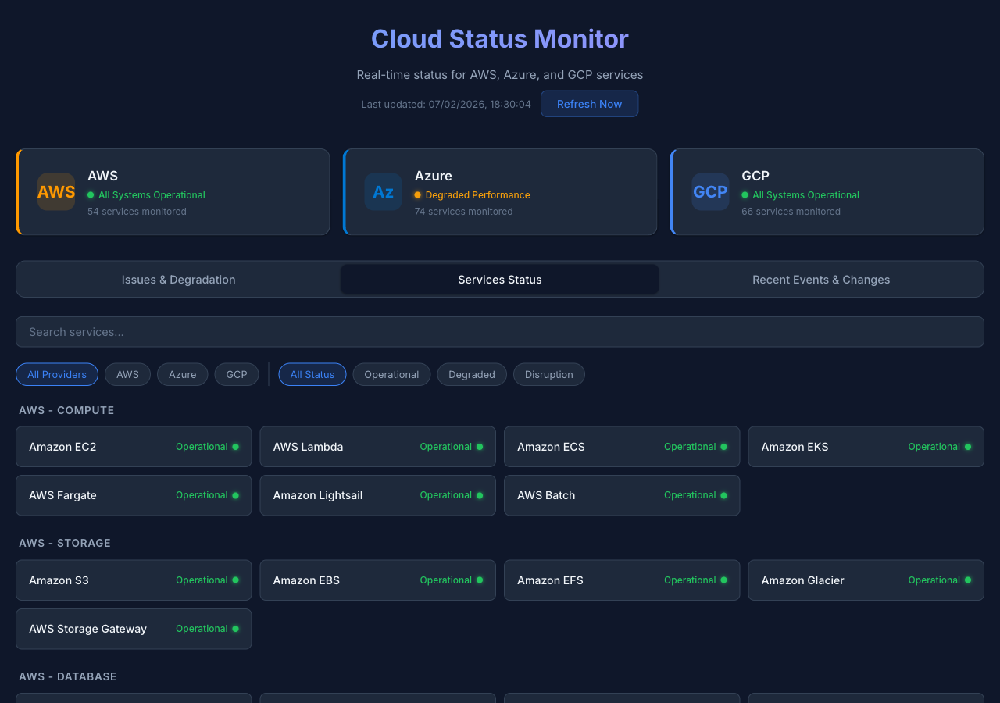
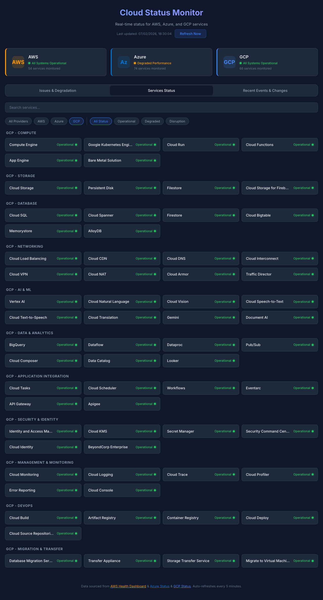
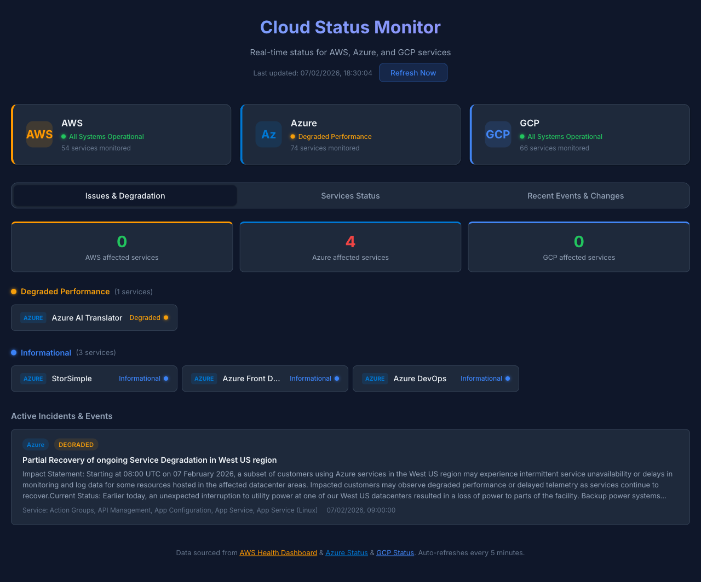
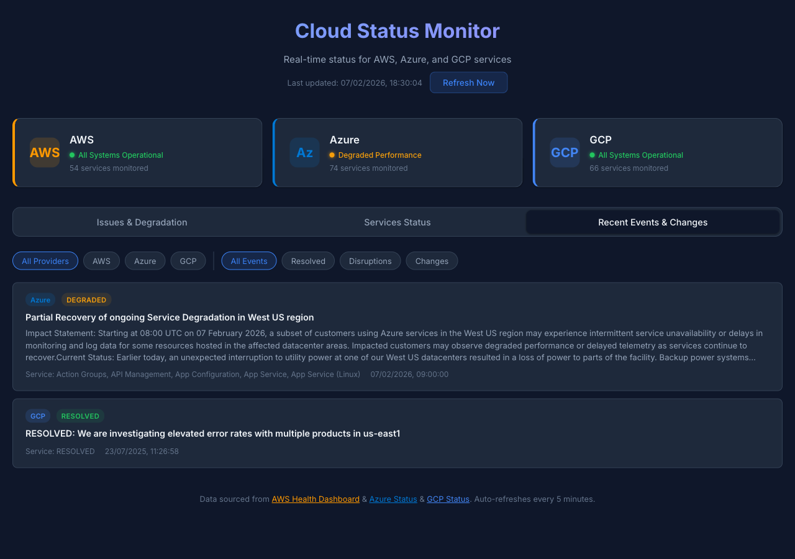

# Cloud Status Monitor

Real-time monitoring dashboard for **AWS**, **Azure**, and **GCP** cloud service status.

Built with React.js on the frontend and Node.js/Express on the backend, orchestrated via Docker Compose.

---

## Table of Contents

- [Features](#features)
- [Dashboard Guide](#dashboard-guide)
- [Architecture](#architecture)
- [Tech Stack](#tech-stack)
- [Quick Start with Docker](#quick-start-with-docker)
- [Local Development](#local-development)
- [Project Structure](#project-structure)
- [REST API](#rest-api)
- [Monitored Services](#monitored-services)
- [Data Sources](#data-sources)
- [How It Works](#how-it-works)
- [Configuration](#configuration)
- [Troubleshooting](#troubleshooting)

---

## Features

- **194 services monitored** (54 AWS + 74 Azure + 66 GCP) across 31 categories
- **Real-time status** collected from official AWS, Azure, and GCP public APIs
- **Issues & Degradation dashboard** for quick triage of non-operational services across all providers
- **Event and incident timeline** with automatic classification (disruption, degraded, resolved, change, maintenance)
- **Advanced filters**: by provider (AWS/Azure/GCP), by status (operational/degraded/disruption), and text search by name
- **Auto-refresh**: backend updates every 5 minutes via cron, frontend polls every 60 seconds
- **Manual refresh**: button to force an immediate data update
- **Dark theme** with responsive design (mobile and desktop)
- **Healthcheck** built into Docker for backend self-monitoring

---

## Dashboard Guide

### Overview

When you open the application, you are greeted with a **dark-themed dashboard** showing the real-time status of three major cloud providers: AWS, Azure, and GCP.

At the top, **three status banners** give you an instant snapshot — each banner displays the provider's overall health, the number of monitored services, and a color-coded indicator:
- **Green** = All Systems Operational
- **Yellow** = Degraded Performance
- **Red** = Service Disruption

Below the banners, **three tabs** let you switch between different views of the data.

---

### Services Status Tab



The **Services Status** tab shows every monitored service organized by provider and category (e.g., _AWS - Compute_, _Azure - Database_, _GCP - Networking_).

**Key features:**
- **Search bar**: Type any service name to instantly filter results (e.g., "Lambda", "Kubernetes", "BigQuery")
- **Provider filter**: Click **AWS**, **Azure**, or **GCP** to show only that provider's services
- **Status filter**: Click **Operational**, **Degraded**, or **Disruption** to find affected services quickly
- Each service card displays the service name, its current status label, and a color-coded dot

This is the best view for browsing all 194 services and checking specific ones by name.

---

### GCP Services (Filtered View)



When you click the **GCP** filter button, only Google Cloud services are displayed — organized across 11 categories including Compute, Storage, Database, Networking, AI & ML, and more.

This filtered view is useful when you want to focus on a single provider without visual clutter from the others. The same filtering logic works for AWS and Azure.

---

### Issues & Degradation Tab



The **Issues & Degradation** tab is designed for **quick triage**. Instead of browsing hundreds of operational services, it highlights only the ones that need attention.

**How it works:**
- **Summary cards** at the top show the count of affected services per provider
- Services are grouped by severity: **Disruptions** (red) > **Degraded** (yellow) > **Informational** (blue)
- Each affected service card shows the provider badge and current status
- Below the services, an **Active Incidents & Events** timeline displays non-resolved incidents sorted by date

When all services are healthy, this tab shows a green **"All Systems Operational"** banner — meaning there is nothing that requires your attention.

---

### Recent Events & Changes Tab



The **Recent Events & Changes** tab provides a chronological timeline of all events across providers — including resolved incidents, ongoing disruptions, service changes, and maintenance notices.

**Filtering options:**
- **Provider filter**: Show events from All Providers, AWS only, Azure only, or GCP only
- **Type filter**: Filter by All Events, Resolved, Disruptions, or Changes

Each event card includes:
- A **provider badge** (color-coded: orange for AWS, blue for Azure, green for GCP)
- An **event type badge** (resolved, disruption, degraded, change, maintenance)
- The event title and description
- The affected service name and timestamp

This view is ideal for understanding the timeline of incidents and reviewing what happened recently.

---

## Architecture

```
                        +-------------------+
                        |      User         |
                        |    (Browser)      |
                        +--------+----------+
                                 |
                            port 3000
                                 |
                  +--------------v--------------+
                  |         Frontend             |
                  |     (React + nginx)          |
                  |                              |
                  |  /          -> index.html    |
                  |  /api/*     -> proxy backend |
                  |  /static/*  -> cached assets |
                  +--------------+--------------+
                                 |
                        Docker internal network
                        (cloud-status network)
                                 |
                  +--------------v--------------+
                  |          Backend             |
                  |    (Node.js + Express)       |
                  |                              |
                  |  In-memory cache             |
                  |  Cron job (every 5 min)      |
                  +-----+----------+--------+---+
                        |          |        |
            +-----------v--+  +----v------+ +--v-----------+
            |  AWS APIs     |  | Azure APIs| | GCP APIs     |
            |               |  |           | |              |
            | currentevents |  | status pg | | incidents    |
            | RSS feed      |  | RSS feed  | | Atom feed    |
            +---------------+  +-----------+ +--------------+
```

**Data flow:**

1. The **backend** collects data from AWS, Azure, and GCP every 5 minutes and stores it in an in-memory cache
2. The **frontend** (nginx) serves React static files and reverse-proxies `/api/*` calls to the backend
3. React polls the `/api/status` endpoint every 60 seconds and renders the dashboard
4. The user can force a refresh via the button, which calls `POST /api/refresh`

---

## Tech Stack

| Layer | Technology | Version |
|-------|-----------|---------|
| Frontend | React.js | 18.3.x |
| Frontend (prod) | nginx | alpine |
| Backend | Node.js | 20 (alpine) |
| Backend | Express | 4.21.x |
| XML Parsing | xml2js | 0.6.x |
| HTTP Client | node-fetch | 2.7.x |
| Scheduler | node-cron | 3.0.x |
| Orchestration | Docker Compose | v2 |

---

## Quick Start with Docker

### Prerequisites

- Docker and Docker Compose installed

### Run

```bash
git clone <repo-url> cloud-status
cd cloud-status
docker compose up --build
```

Open: **http://localhost:3000**

### Stop

```bash
docker compose down
```

### Run in background

```bash
docker compose up --build -d
```

### View logs

```bash
# All services
docker compose logs -f

# Backend only
docker compose logs -f backend

# Frontend only
docker compose logs -f frontend
```

### Rebuild after changes

```bash
docker compose up --build
```

---

## Local Development

### Backend (port 4000)

```bash
cd backend
npm install
npm run dev     # with auto-reload (node --watch)
# or
npm start       # without auto-reload
```

The backend starts and begins collecting data immediately. Test with:

```bash
curl http://localhost:4000/api/health
curl http://localhost:4000/api/status | jq .
```

### Frontend (port 3000)

Requires the backend running on port 4000.

```bash
cd frontend
npm install
REACT_APP_API_URL=http://localhost:4000/api npm start
```

The React dev server starts with hot-reload at **http://localhost:3000**.

### Both simultaneously (without Docker)

Terminal 1:
```bash
cd backend && npm install && npm run dev
```

Terminal 2:
```bash
cd frontend && npm install && REACT_APP_API_URL=http://localhost:4000/api npm start
```

---

## Project Structure

```
cloud-status/
├── docker-compose.yml          # Container orchestration
├── README.md                   # This file
├── .gitignore                  # Git ignore rules
│
├── docs/
│   └── screenshots/            # Dashboard screenshots for README
│       ├── 01-services-status.png
│       ├── 02-issues-dashboard.png
│       ├── 03-events-timeline.png
│       └── 04-gcp-services.png
│
├── backend/                    # Node.js/Express API
│   ├── Dockerfile              # Node 20 Alpine image
│   ├── .dockerignore
│   ├── package.json
│   ├── server.js               # Express server + routes + cache + cron
│   └── services/
│       ├── aws.js              # AWS status collection (API + RSS)
│       ├── azure.js            # Azure status collection (HTML scraping + RSS)
│       └── gcp.js              # GCP status collection (incidents JSON + Atom feed)
│
└── frontend/                   # React.js SPA
    ├── Dockerfile              # Multi-stage: Node (build) + nginx (serve)
    ├── .dockerignore
    ├── nginx.conf              # Reverse proxy + asset caching
    ├── package.json
    ├── public/
    │   └── index.html          # HTML template
    └── src/
        ├── index.js            # React entry point
        ├── App.js              # Main component + data fetching
        ├── components/
        │   ├── StatusBanner.js    # Per-provider status banner
        │   ├── ServicesList.js    # Service grid with filters
        │   ├── EventsList.js      # Event/incident timeline
        │   └── IssuesDashboard.js # Issues & degradation triage view
        └── styles/
            └── global.css      # Dark theme + responsive layout
```

---

## REST API

The backend exposes the following endpoints:

### `GET /api/health`

Server health check.

```json
{
  "status": "ok",
  "uptime": 123.456
}
```

### `GET /api/status`

Returns status for all providers.

```json
{
  "aws": {
    "status": {
      "provider": "AWS",
      "overallStatus": "operational",
      "totalServices": 54,
      "categories": ["Compute", "Storage", "Database", ...],
      "servicesByCategory": { ... },
      "services": [...],
      "recentEvents": [...],
      "activeIncidents": 0
    },
    "lastUpdated": "2026-02-07T17:00:00.000Z"
  },
  "azure": {
    "status": {
      "provider": "Azure",
      "overallStatus": "operational",
      "totalServices": 74,
      "categories": ["Compute", "Storage", "Database", ...],
      "servicesByCategory": { ... },
      "services": [...],
      "recentEvents": [...]
    },
    "lastUpdated": "2026-02-07T17:00:00.000Z"
  },
  "gcp": {
    "status": {
      "provider": "GCP",
      "overallStatus": "operational",
      "totalServices": 66,
      "categories": ["Compute", "Storage", "Database", ...],
      "servicesByCategory": { ... },
      "services": [...],
      "recentEvents": [...],
      "activeIncidents": 0
    },
    "lastUpdated": "2026-02-07T17:00:00.000Z"
  }
}
```

### `GET /api/status/aws`

Returns AWS status only.

### `GET /api/status/azure`

Returns Azure status only.

### `GET /api/status/gcp`

Returns GCP status only.

### `POST /api/refresh`

Forces an immediate data refresh.

```json
{
  "message": "Refreshed",
  "timestamp": "2026-02-07T17:05:00.000Z"
}
```

### Service Data Model

```json
{
  "name": "Amazon EC2",
  "slug": "amazon-ec2",
  "region": "global",
  "status": "operational",
  "statusRaw": "operational"
}
```

### Event Data Model

```json
{
  "title": "Service Degradation in West US region",
  "description": "A subset of customers using Azure services...",
  "date": "Sat, 07 Feb 2026 08:00:00 Z",
  "guid": "partial-recovery-of-ongoing-service-degradation",
  "service": "Virtual Machines, App Service, Azure Functions",
  "type": "degraded"
}
```

### Status Types

| Status | Meaning | Color |
|--------|---------|-------|
| `operational` | All systems functioning normally | Green |
| `informational` | Informational event, minimal impact | Blue |
| `degraded` | Degraded performance | Yellow |
| `disruption` | Service disruption | Red |
| `maintenance` | Planned maintenance | Purple |

### Event Types

| Type | Description |
|------|-------------|
| `resolved` | Incident resolved |
| `disruption` | Active disruption |
| `degraded` | Performance degradation |
| `informational` | Informational event |
| `change` | Policy or service change |
| `maintenance` | Planned maintenance |

---

## Monitored Services

### AWS (54 services across 10 categories)

| Category | Services |
|----------|---------|
| Compute | EC2, Lambda, ECS, EKS, Fargate, Lightsail, Batch |
| Storage | S3, EBS, EFS, Glacier, Storage Gateway |
| Database | RDS, DynamoDB, Aurora, ElastiCache, Redshift, DocumentDB |
| Networking | VPC, CloudFront, Route 53, ELB, Direct Connect, API Gateway |
| Application Integration | SQS, SNS, EventBridge, Step Functions |
| Security & Identity | IAM, KMS, Cognito, WAF, Shield, Secrets Manager |
| Management & Monitoring | CloudWatch, CloudFormation, CloudTrail, Systems Manager, Config |
| AI & Machine Learning | SageMaker, Bedrock, Rekognition, Comprehend, Polly, Transcribe |
| Developer Tools | CodePipeline, CodeBuild, CodeDeploy, CodeCommit |
| Analytics | Kinesis, Athena, Glue, EMR, OpenSearch Service |

### Azure (74 services across 10 categories)

| Category | Services |
|----------|---------|
| Compute | VMs, VMSS, App Service, Functions, AKS, Container Instances, Batch, Cloud Services, Spring Apps |
| Storage | Storage Accounts, Backup, Site Recovery, StorSimple, NetApp Files, HPC Cache, Managed Lustre |
| Database | Cosmos DB, SQL Database, MySQL, PostgreSQL, MariaDB, Cache for Redis, SQL Managed Instance |
| Networking | VNet, Load Balancer, VPN Gateway, App Gateway, Firewall, DDoS Protection, ExpressRoute, Private Link, Front Door, Virtual WAN, Network Watcher, WAF |
| AI & Machine Learning | ML, Cognitive Services, AI services, AI Search, AI Language, AI Vision, AI Speech, AI Translator, OpenAI |
| Integration & Messaging | Service Bus, Event Grid, Event Hubs, API Management, Logic Apps, Notification Hubs, SignalR |
| Identity & Security | Active Directory, Key Vault, Sentinel, Defender for Cloud, DDoS Protection |
| Management & Monitoring | Monitor, Log Analytics, Resource Manager, Automation, Policy, Advisor |
| Analytics | Synapse Analytics, HDInsight, Databricks, Data Factory, Stream Analytics, Data Explorer, Power BI Embedded |
| DevOps | Azure DevOps, DevTest Labs, Container Registry |

### GCP (66 services across 11 categories)

| Category | Services |
|----------|---------|
| Compute | Compute Engine, GKE, Cloud Run, Cloud Functions, App Engine, Bare Metal Solution |
| Storage | Cloud Storage, Persistent Disk, Filestore, Cloud Storage for Firebase |
| Database | Cloud SQL, Cloud Spanner, Firestore, Cloud Bigtable, Memorystore, AlloyDB |
| Networking | Cloud Load Balancing, Cloud CDN, Cloud DNS, Cloud Interconnect, Cloud VPN, Cloud NAT, Cloud Armor, Traffic Director |
| AI & ML | Vertex AI, Cloud Natural Language, Cloud Vision, Cloud Speech-to-Text, Cloud Text-to-Speech, Cloud Translation, Gemini, Document AI |
| Data & Analytics | BigQuery, Dataflow, Dataproc, Pub/Sub, Cloud Composer, Data Catalog, Looker |
| Application Integration | Cloud Tasks, Cloud Scheduler, Workflows, Eventarc, API Gateway, Apigee |
| Security & Identity | IAM, Cloud KMS, Secret Manager, Security Command Center, Cloud Identity, BeyondCorp Enterprise |
| Management & Monitoring | Cloud Monitoring, Cloud Logging, Cloud Trace, Cloud Profiler, Error Reporting, Cloud Console |
| DevOps | Cloud Build, Artifact Registry, Container Registry, Cloud Deploy, Cloud Source Repositories |
| Migration & Transfer | Database Migration Service, Transfer Appliance, Storage Transfer Service, Migrate to VMs |

---

## Data Sources

### AWS

| Source | URL | Format | Usage |
|--------|-----|--------|-------|
| Health API | `https://health.aws.amazon.com/public/currentevents` | JSON (UTF-16 BE) | Active incidents |
| RSS Feed | `https://status.aws.amazon.com/rss/all.rss` | XML/RSS | Recent events |

The AWS API returns a JSON array of active events. When there are no incidents, it returns `[]`. The encoding is UTF-16 Big-Endian with BOM, which requires special decoding handling.

### Azure

| Source | URL | Format | Usage |
|--------|-----|--------|-------|
| Status Page | `https://azure.status.microsoft/en-us/status` | HTML | Per-service, per-region status |
| RSS Feed | `https://rssfeed.azure.status.microsoft/en-us/status/feed/` | XML/RSS | Events and incidents |

The Azure status page is parsed (HTML scraping) to extract the status of each service across regions. The aggregation logic uses proportion-based thresholds:

- **>=50% regions affected** with Critical -> `disruption`
- **>=20% regions affected** with Critical -> `degraded`
- **>=50% regions affected** with Warning -> `degraded`
- **>=15% regions affected** with Warning -> `informational`
- **<15% regions affected** -> `operational` (localized impact)

### GCP

| Source | URL | Format | Usage |
|--------|-----|--------|-------|
| Incidents API | `https://status.cloud.google.com/incidents.json` | JSON | Active & historical incidents |
| Atom Feed | `https://status.cloud.google.com/en/feed.atom` | Atom/XML | Recent events and updates |

GCP provides structured incident data with explicit severity levels (`SERVICE_OUTAGE`, `SERVICE_DISRUPTION`, `AVAILABLE`) and lists of affected products. Active incidents are identified by a null/empty `end` field.

---

## How It Works

### Data Collection (Backend)

1. A **cron job** (`*/5 * * * *`) triggers `refreshAllStatus()` every 5 minutes
2. `fetchAWSStatus()`, `fetchAzureStatus()`, and `fetchGCPStatus()` are called in parallel via `Promise.allSettled()`
3. Each function collects data from its respective APIs and normalizes it into a unified format
4. Results are stored in an **in-memory cache** with a timestamp
5. If one API fails, the previous cache is preserved (partial resilience)

### Display (Frontend)

1. `App.js` calls `fetch('/api/status')` on load and every 60 seconds
2. Data is passed to the `StatusBanner`, `IssuesDashboard`, `ServicesList`, and `EventsList` components
3. The **Issues & Degradation** tab provides a triage view of all non-operational services grouped by severity
4. Provider, status, and search filters are applied client-side using `useMemo`
5. Events from all three providers are merged and sorted by date

### Docker Compose

1. The **backend** starts first and runs a healthcheck (`/api/health`) every 30 seconds
2. The **frontend** only starts after the backend is healthy (`depends_on: condition: service_healthy`)
3. nginx in the frontend reverse-proxies `/api/*` to `http://backend:4000/api/`
4. The internal `cloud-status` network allows inter-container communication by service name

---

## Configuration

### Environment Variables

#### Backend

| Variable | Default | Description |
|----------|---------|-------------|
| `PORT` | `4000` | Express server port |
| `NODE_ENV` | `production` | Runtime environment |

#### Frontend (build time)

| Variable | Default | Description |
|----------|---------|-------------|
| `REACT_APP_API_URL` | `/api` | API base URL (in dev: `http://localhost:4000/api`) |

### Ports

| Service | Host Port | Container Port |
|---------|-----------|---------------|
| Frontend | 3000 | 80 |
| Backend | 4000 | 4000 |

---

## Troubleshooting

### Frontend shows "Loading cloud status..." indefinitely

The backend may not have finished collecting data yet (takes ~3-5s on first run). Wait a few seconds and reload.

### Connection error on frontend

Check that the backend is running and healthy:

```bash
curl http://localhost:4000/api/health
```

### Docker build fails on frontend

The React build can consume significant memory. Make sure Docker has at least 2GB available.

### Data not updating

The backend caches data for 5 minutes. Use the "Refresh Now" button in the dashboard or:

```bash
curl -X POST http://localhost:4000/api/refresh
```

### Azure shows many services as "informational"

This can happen during a regional incident. The system uses thresholds to determine severity based on the proportion of affected regions. An incident in a single region (e.g., West US) won't mark the service as "degraded" globally.

### AWS shows no events

The AWS API (`/public/currentevents`) returns an empty array when there are no active incidents. The RSS feed only contains recent events. If there are no recent incidents, both will be empty - this is normal and expected.

### GCP shows all services as operational

GCP's `incidents.json` only contains incidents with explicit start/end times. If no incidents are currently active (i.e., all have an `end` timestamp), all services will show as operational. The Atom feed provides historical event context in the Events tab.
